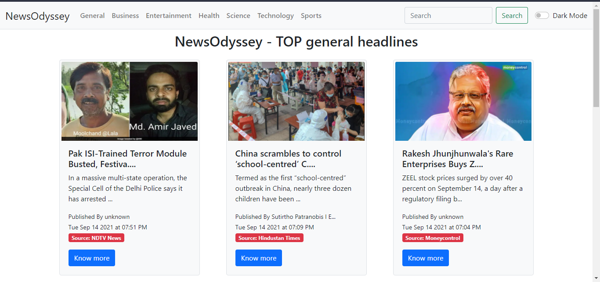
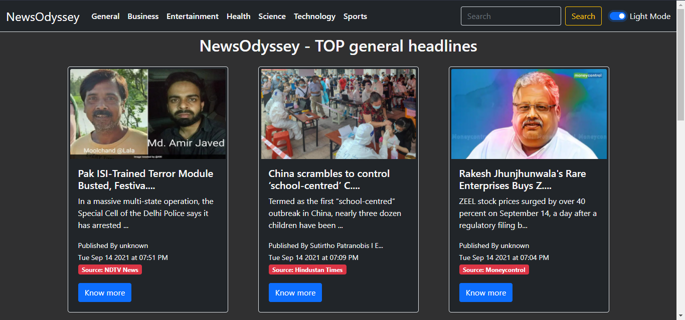
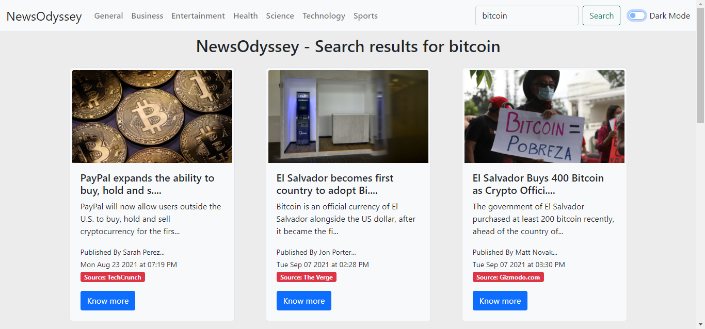

# NewsOdyssey

NewsOdyssey is a news web app that shows the latest news and headlines every day. From sports to politics and from technology to weather reports, all kinds of news in one place.

This project was bootstrapped with [Create React App](https://github.com/facebook/create-react-app).

- It uses [News API](https://newsapi.org/) API to fetch all sorts of news.
- It has infinity scrolling i.e. when scrolled to the bottom, it fetches more news until all items of news are displayed.
- It has both light mode and dark mode

- It has a search box to search for a specific news

